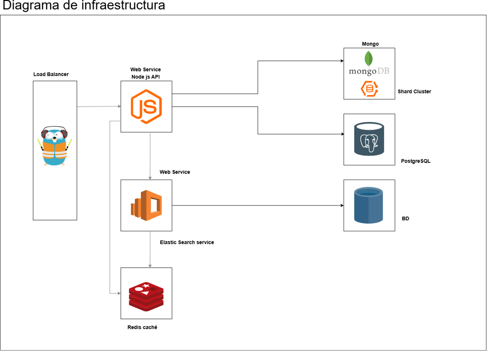

# Arquitectura Lógica

En esta sección, describimos como están organizados los contenedores a nivel funcional. 

## Diagrama

## Componentes

| Componente     | Descripción                                                                                                                   | Más información                                     |
|----------------|-------------------------------------------------------------------------------------------------------------------------------|-----------------------------------------------------|
| **backend**     | Microservicio principal (API) para consultas del sistema, implementado en Node.js.                                           | [API](./API.md)                                     |
| **search**      | Servicio de búsqueda avanzada usando ElasticSearch para consultas complejas.                                                 | [Elastic](./elastic.md)                             |
| **bases de datos** | Se utilizan PostgreSQL (relacional) y MongoDB (sharding + replicación), no de forma simultánea.                          | [Databases](./databases.md)                    |
| **caché**       | Servicio Redis para almacenamiento de respuestas frecuentes y mejora del rendimiento.                                       | [Cache](./redisCache.md)                            |
| **balanceador** | Traefik como proxy inverso y balanceador de carga en ambientes con escalamiento horizontal.                                 | [Load Balancer](./balanceadorCarga.md)      |
| **pipeline**    | Pipeline CI/CD en GitHub Actions para pruebas automáticas y publicación de imágenes en Docker Hub (`josianamj`).             | [Pipeline CI/CD](./pipeline.md)                     |

