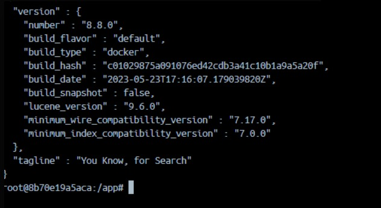
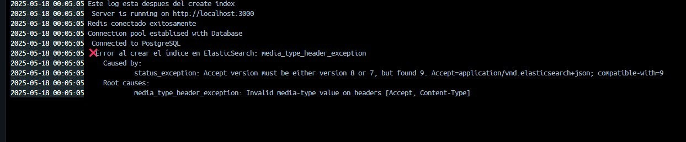
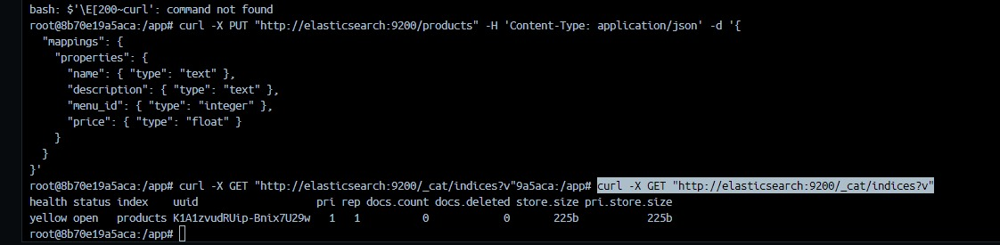
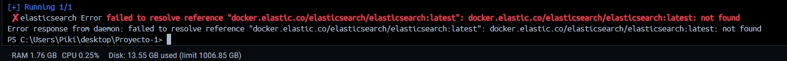
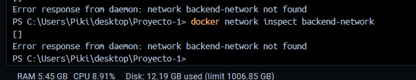

# Integración de ElasticSearch en proyecto restaurante

Este documento detalla los intentos realizados para integrar ElasticSearch en el proyecto del restaurante, con el objetivo de indexar productos en un motor de búsqueda rápido y optimizado. Aunque el resultado no fue exitoso, se documenta el proceso, los errores encontrados y las soluciones intentadas.


## **Propuesta de implementación**

Dentro del repositorio se añadieron los siguientes archivos: 

```yaml
backend/
│
├── db/
│   ├── elasticClient.js               # Cliente de conexión a Elastic
│   ├── createElasticIndex.js          # Creación del índice en Elastic
│
├── controllers/
│   └── searchController.js            # Lógica para búsquedas
│
├── repositories/
│   └── searchRepository.js            # Métodos para interactuar con ElasticSearch
│
├── routes/
│   └── searchRoutes.js                # Rutas para búsquedas
│
└── app.js 
```

## **Levantar el servicio en el compose**
```yaml
elasticsearch:
  image: docker.elastic.co/elasticsearch/elasticsearch:8.8.0
  environment:
    - discovery.type=single-node
    - network.host=0.0.0.0
    - xpack.security.enabled=false
  ports:
    - "9200:9200"
  volumes:
    - elastic-data:/usr/share/elasticsearch/data
  networks:
    - backend-network
```

## **Crear el cliente de conexión**
```Javascript
const { Client } = require('@elastic/elasticsearch');

const elasticClient = new Client({
  node: process.env.ELASTIC_URL,
  maxRetries: 5,
  requestTimeout: 60000,
  sniffOnStart: true
});

module.exports = elasticClient;
```
---
# Prueba de las conexiones 

Este log muestra la conexión con el servicio de elastic que se levantó en el compose



Para confirmar que ElasticSearch esté en pie y respondiendo correctamente desde el backend, se hizo una prueba interna en el contendedor:

```Javascript
(async () => {
  try {
    await client.ping({}, { requestTimeout: 3000 });
    console.log('🟢 Elasticsearch is up and running!');
  } catch (error) {
    console.error('🔴 Elasticsearch cluster is down!', error.message);
  }
})();
```

Dichaprueba devolvió el resultado esperado:


## ⚠️**Errores a partir de aquí**

1. **Creación del index de Products**

Se creó un archivo llamado createElasticIndex.js cuya función era al hacer node al app.js levantar el índice "products" para guardar los productos, sin embargo, al hacer el compose y revisar los logs del backend se mostraba el mensaje de error en la creación.



Lo que significa que el archivo `createElasticIndex.js` no estaba levantando el índice de productos.

Para solucionar esto, entramos al contenedor directamente para crear el índice desde ahí.

##### Creación manual del índice

Para la creación manual entramos al contenedor  con el comando docker exec -it proyecto-1-backend-1 /bin/bash `docker exec -it proyecto-1-backend-1 /bin/bash`

Y desde le contenedor se hizo la solicitud 

```bash
curl -X PUT "http://elasticsearch:9200/products" -H 'Content-Type: application/json' -d '{
  "mappings": {
    "properties": {
      "name": { "type": "text" },
      "description": { "type": "text" },
      "menu_id": { "type": "integer" },
      "price": { "type": "float" }
    }
  }
}'
```
Luego de crearlo se verifica la existencia del mismo con el comando:  `curl -X GET "http://elasticsearch:9200/_cat/indices?v"`

El resultado fue el siguiente:



En donde se ve que el índice fue creado.

A partir de aquí se modificó el controller de productos para insertar una vez creado un producto en las bases de datos y en Elastic porque logrando insertar los productos, la búsqueda sería más rapida de implementar.

Pero los problemas a partir del intento de insertar productos no nos dejaron avanzar.

Cuando se intentó hacer un POST para crear un producto se obtuvo el siguiente error:


Ese error se debe a un problema de compatibilidad entre la versión de Elasticsearch (8.x) y la configuración de los headers en el cliente de Elasticsearch.

Para solucionarlo tratamos de cambiar la imagen del compose a latest, pero eso también nos dio un error:



Ese error se corrigió arreglando el compose y la versión d ela imegn, sin embargo, apareció un nuevo error al tratar de hacer el POST:


ResponseError: media_type_header_exception<br>	Caused by:<br>		illegal_argument_exception: Incorrect header [Accept]. Only one value should be provided<br>	Root causes:<br>		media_type_header_exception: Invalid media-type value on headers [Accept]<br> &nbsp; &nbsp;at SniffingTransport._request (/app/node_modules/@elastic/transport/lib/Transport.js:533:27)<br> &nbsp; &nbsp;at process.processTicksAndRejections (node:internal/process/task_queues:95:5)<br> &nbsp; &nbsp;at async /app/node_modules/@elastic/transport/lib/Transport.js:631:32<br> &nbsp; &nbsp;at async SniffingTransport.request (/app/node_modules/@elastic/transport/lib/Transport.js:627:20)<br> &nbsp; &nbsp;at async Client.IndexApi [as index] (/app/node_modules/@elastic/elasticsearch/lib/api/api/index.js:77:12)<br> &nbsp; &nbsp;at async createProduct (/app/controllers/productController.js:28:5)</pre>


Este error está relacionado a la forma en que las versiones manejan los headers en los request. Después de aquí no pudimos solucionar y comenzamos a tener problemas con la conexion con Elastic y con el network del backend.




## Conclusiones

Se realizaron múltiples intentos de conexión y configuración para que ElasticSearch funcionara correctamente con Docker, Traefik y Node.js.

Los problemas de incompatibilidad de headers y errores de red fueron las causas principales de los fallos.

A pesar de los múltiples intentos, la integración no se completó exitosamente, pero queda demostrado en la documentación los errores y las soluciones probadas.


