# PY01 Restaurantes e2
__Curso:__ Bases de Datos II  
__Periodo:__ I Sem 2025  
__Estudiantes:__ Brandon Badilla y Josi Marin  
__Fecha de entrega:__ 17 de mayo del 2025  

## Video
https://youtu.be/_1SNJjjM_tg 

## GitHub


## Contenidos

- Arquitectura Lógica p.2
- Arquitectura Física p.3
- Flujo de Datos p.5
- Microservicios 
  - API p.6
  - Búsqueda p.7
- Otros componentes
  - Caché p.13
  - Bases de datos simultáneas p.16
  - Balanceador de carga/router p.18
  - Pipeline CI/CD p.19


## Ejecucion

#### Requisitos Previos
 - Tener instalado Docker. De no cumplirlo, acceder [aqui](https://docs.docker.com/desktop/setup/install/windows-install/) para descargarlo.
 - Tener Docker correctamente configurado para ejecucion de proyectos. De no cumplirlo, acceder [aqui](https://docs.docker.com/get-started/) para realizar los pasos de configuracion.
 - Descargar el codigo fuente del proyecto.
 - (Opcional) Tener instalado Visual Studio Code. De no cumplirlo, puede ser necesario cambiar los comandos de ejecución ligeramente. Puede acceder [aqui](https://code.visualstudio.com/docs/setup/windows)

#### Ejecucion
Los siguientes pasos de ejecucion son para la terminal Powershell Windows dentro del editor de texto Visual Studio Code. 

1. __Descargar imagenes de Docker__
Con los siguientes comandos se descargarán las versiones más recientes de las imagenes creadas para este proyecto. 

```powershell
docker pull josianamj/postgres_db:latest 
docker pull josianamj/backend_image:latest
docker pull josianamj/redis_image:latest
docker pull josianamj/setup_mongo:latest
```


2. __Levantar los contenedores__
Por medio del siguiente comando, se realizará el levantamiento de los contenedores que componen el sistema del proyecto.

```powershell
docker-compose up -d
```

⚠️ __Importante:__ Al ejecutar este comando, el servicio toma un tiempo en levantarse completamente. No realizar consultas hasta que el comando "termine" su ejecucion pues resultara en errores. 

Si desea realizar escalado vertical de los microservicios, puede agregar el argumento `--scale service_name=quantity` al comando previo, por ejemplo, levantar 3 instancias de la API se veria de la siguiente forma:
```powershell
docker compose up -d --scale backend=3 
```

3. __Bajar los contenedores:__ Al finalizar las pruebas, puede "bajar" (detener la ejecucion y eliminar) los contenedores por medio del siguiente comando:

```powershell
docker compose down -v
```


# **Arquitectura Lógica**

En esta sección, describimos como están organizados los contenedores a nivel funcional. 


## Componentes

| Componente       | Descripción                                                                                                                   |
|------------------|-------------------------------------------------------------------------------------------------------------------------------|
| **backend**       | Microservicio principal (API) para consultas del sistema, implementado en Node.js.                                           |
| **search**        | Servicio de búsqueda avanzada usando ElasticSearch para consultas complejas.                                                 |
| **bases de datos**| Se utilizan PostgreSQL (relacional) y MongoDB (sharding + replicación), no de forma simultánea.                              |
| **caché**         | Servicio Redis para almacenamiento de respuestas frecuentes y mejora del rendimiento.                                        |
| **balanceador**   | Traefik como proxy inverso y balanceador de carga en ambientes con escalamiento horizontal.                                  |
| **pipeline**      | Pipeline CI/CD en GitHub Actions para pruebas automáticas y publicación de imágenes en Docker Hub (`josianamj`).                      |


## Diagrama

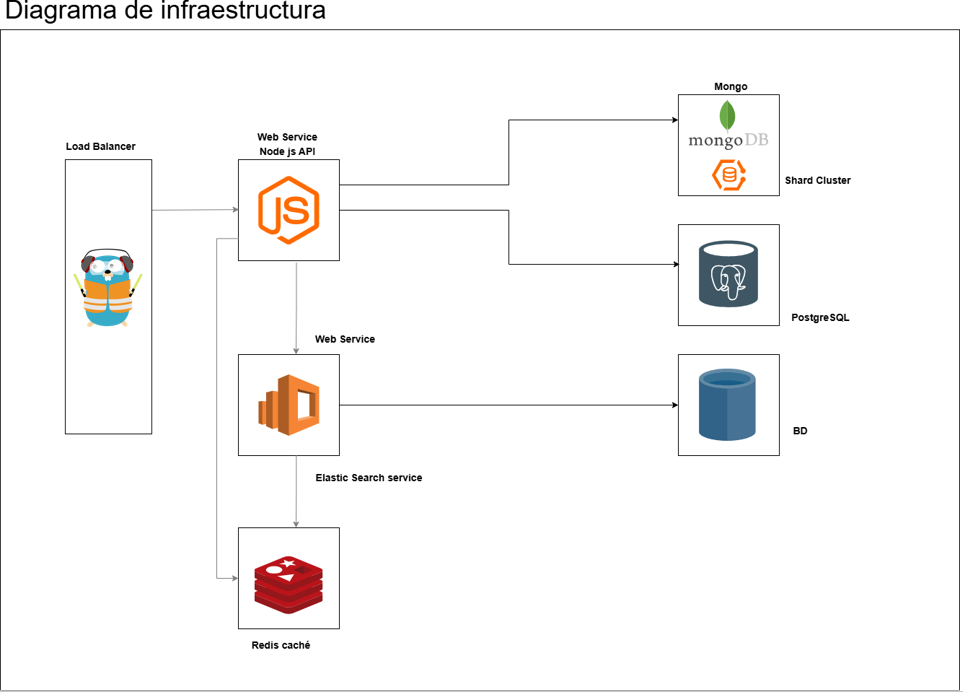

# **Arquitectura Física**

Esta sección describe cómo se implementa físicamente la arquitectura del sistema de microservicios utilizando contenedores Docker, redes virtuales y volúmenes persistentes.

## Infraestructura de contenedores

Todo el sistema está orquestado mediante `docker-compose`, lo que permite levantar múltiples servicios de forma coordinada. Cada componente del sistema corre como un contenedor independiente y aislado.

### Contenedores principales

| Componente     | Imagen                           | Rol                                                       |
|----------------|----------------------------------|------------------------------------------------------------|
| `backend`      | `josianamj/backend_image`        | API principal que interactúa con bases de datos y clientes |
| `search`       | `josianamj/search_service`       | Servicio para consultas distribuidas en MongoDB            |
| `db`           | `josianamj/postgres_db`          | Base de datos PostgreSQL                                   |
| `redis`        | `josianamj/redis_image`          | Sistema de caché en memoria                                |
| `traefik`      | `traefik:v2.11`                  | Proxy inverso y balanceador de carga                       |
| `mongos1`      | `mongo`                          | Enrutador del clúster MongoDB                              |
| `mongors*`     | `mongo`                          | Réplicas para los shards de MongoDB                        |
| `mongocfg*`    | `mongo`                          | Config servers de MongoDB                                  |
| `setup-mongo`  | `josianamj/setup_mongo`          | Script de configuración inicial del clúster MongoDB        |
| `charge-data`  | `josianamj/charge_data`          | Script de insercion de datos simulados utilizando MML      |


## Redes

Se definieron redes personalizadas para aislar el tráfico según los contextos funcionales:

- `backend-network`: conecta `traefik`, `backend` y `db`
- `mongo-replica-sharding`: conecta todos los nodos Mongo, `search`, y `redis`

Estas redes aseguran que los servicios sólo puedan comunicarse con aquellos a los que están destinados.


## Puertos expuestos

| Servicio  | Puerto externo | Interno en contenedor |
| --------- | -------------- | --------------------- |
| `traefik` | `80`, `8080`   | `80`, `8080`          |
| `backend` | (interno solo) | `3000`                |
| `search`  | (interno solo) | `4000`                |
| `db`      | `5432`         | `5432`                |
| `redis`   | `6379`         | `6379`                |
| `mongos1` | `27019`        | `27017`               |

A excepcion de Traefik, el resto de servicios no exponen sus puertos publicamente, solo se accede a ellos mediante redes internas de Docker.
A Traefik se accede por medio de http://localhost/

## Escalabilidad

El servicio `backend` se pueden escalar horizontalmente mediante:
```powershell
docker compose up -d --scale backend=3
```
A lo cual Traefik detecta automaticamente las nuevas instancias y balancea la carga de las solicitudes entre ellas.

## Persistencia

El sistema esta diseñado para asegurar la persistencia de datos mediante volúmenes de Docker, en caso de que un contenedor reinicie o entre múltiples ejecuciones.

El sistema está diseñado para asegurar la persistencia de los datos críticos mediante el uso de **volúmenes Docker**. Estos volúmenes permiten que los datos almacenados por los contenedores no se pierdan al reiniciar o eliminar los servicios.

| Servicio            | Volumen asociado     | Ruta interna                     | Propósito principal                                 |
|---------------------|----------------------|----------------------------------|-----------------------------------------------------|
| `db` (PostgreSQL)   | `db-data`            | `/var/lib/postgresql/data`       | Almacena datos estructurados del sistema            |
| `elasticsearch`     | `elastic-data`       | `/usr/share/elasticsearch/data`  | Persistencia del índice de búsqueda                 |
| `mongors*`          | `data1` a `data9`    | `/data/db`                       | Persistencia por réplica y shard                    |
| `mongocfg*`         | `config1` a `config3`| `/data/db`                       | Datos de configuración del clúster MongoDB          |


# **Flujo de Datos**

En esta sección, describimos cómo fluyen los datos desde que el cliente realiza una consulta hasta que recibe su respuesta.

En las rutas de los ejemplos, se reemplaza la finalizacion de una consulta específica por __*__ para generalizar.

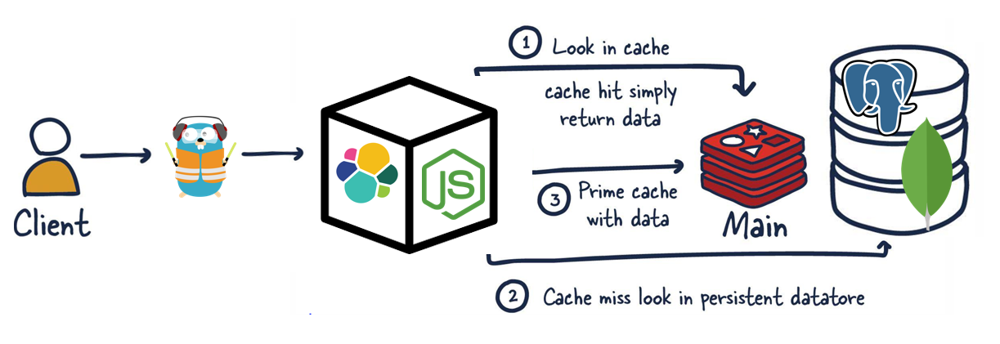

## Flujo de una consulta simple
1. El __cliente__ hace petición a `http://localhost/api/*`
2. __Traefik__ enruta hacia una instancia del __backend__.
3. __Backend__ consulta a __Redis__ si esta respuesta está en caché.
4. Si sí, se considera un _caché hit_ y Redis devuelve la respuesta a __Backend__.
5. Si no, se considera un _caché miss_. __Backend__ consulta a la __Database__ correspondiente, sea este PostgreSQL o MongoDB.
6. __Database__ envía la información a __Backend__.
7. __Backend__ responde al __cliente__. 


# **API REST - Sistema de Gestión de Restaurante**

Esta API está diseñada para gestionar un sistema de restaurante, incluyendo menús, pedidos, reservas, restaurantes y usuarios. Está implementada con Node.js, Express, PostgreSQL/MongoDB y Redis para optimización de caché.


## **Endpoints** / Rutas

### Menús
- `GET /api/menus` - Obtener todos los menús
- `GET /api/menus/:id` - Obtener un menú por ID
- `POST /api/menus` - Crear un nuevo menú
- `PUT /api/menus/:id` - Actualizar un menú existente
- `DELETE /api/menus/:id` - Eliminar un menú


### Pedidos (Orders)
- `GET /api/orders` - Obtener todos los pedidos
- `GET /api/orders/:id` - Obtener un pedido por ID
- `POST /api/orders` - Crear un nuevo pedido
- `PUT /api/orders/:id` - Actualizar un pedido existente
- `DELETE /api/orders/:id` - Eliminar un pedido


### Reservas (Reservations)
- `GET /api/reservations` - Obtener todas las reservas
- `GET /api/reservations/:id` - Obtener una reserva por ID
- `POST /api/reservations` - Crear una nueva reserva
- `PUT /api/reservations/:id` - Actualizar una reserva existente
- `DELETE /api/reservations/:id` - Eliminar una reserva


### Restaurantes (Restaurants)
- `GET /api/restaurant` - Obtener todos los restaurantes
- `GET /api/restaurant/:id` - Obtener un restaurante por ID
- `POST /api/restaurant` - Crear un nuevo restaurante
- `PUT /api/restaurant/:id` - Actualizar un restaurante existente
- `DELETE /api/restaurant/:id` - Eliminar un restaurante


### Usuarios (Users)
- `GET /api/user` - Obtener todos los usuarios
- `GET /api/user/:id` - Obtener un usuario por ID
- `POST /api/user` - Crear un nuevo usuario
- `PUT /api/user/:id` - Actualizar un usuario existente
- `DELETE /api/user/:id` - Eliminar un usuario


### Products (Productos)
- `GET /api/products` - Obtener todos los usuarios
- `GET /api/product/:id` - Obtener un usuario por ID
- `POST /api/product` - Crear un nuevo usuario
- `PUT /api/product/:id` - Actualizar un usuario existente
- `DELETE /api/product/:id` - Eliminar un usuario


## **Middleware de Caché**
Se implementa un sistema de caché en Redis para optimizar las operaciones `GET` en cada endpoint. El middleware verifica si los datos ya están en caché:
- Si existe: Se devuelve desde Redis.
- Si no existe: Se consulta en la base de datos y se almacena en Redis para la siguiente petición.

## Patron Repositorio

Previamente en la TC01 se tenia el manejo de la base de datos desde la API utilizando Modelo, Ruta y Controlador por cada tabla. Sin embargo, para la implementacion de este proyecto es necesario usar de manera intercambiable la base de datos postgres y el uso de mongo, por lo cual se tuvo que reemplazar los _Modelos_ por _Repositorios_. 

El patrón Repositorio permite mantener una estructura centralizada donde se registran las distintas implementaciones de repositorios, y se selecciona dinámicamente cuál usar en tiempo de ejecución. Por tanto, se desencopla totalemente la logica del negocio de la logica de las implementaciones de bases de datos. 

La estructura de esta implementacion se observa de la siguiente manera:

```bash
repositories/
├── mongo/
│ ├── menuRepository.js
│ ├── orderRepository.js
│ ├── ...
├── postgres/
│ ├── menuRepository.js
│ ├── orderRepository.js
│ ├── ...
└── repositoryFactory.js
```


# **Integración de ElasticSearch en proyecto restaurante**

Este documento detalla los intentos realizados para integrar ElasticSearch en el proyecto del restaurante, con el objetivo de indexar productos en un motor de búsqueda rápido y optimizado. Aunque el resultado no fue exitoso, se documenta el proceso, los errores encontrados y las soluciones intentadas.


## **Propuesta de implementación**

Dentro del repositorio se añadieron los siguientes archivos: 

```yaml
backend/
│
├── db/
│   ├── elasticClient.js               # Cliente de conexión a Elastic
│   ├── createElasticIndex.js          # Creación del índice en Elastic
│
├── controllers/
│   └── searchController.js            # Lógica para búsquedas
│
├── repositories/
│   └── searchRepository.js            # Métodos para interactuar con ElasticSearch
│
├── routes/
│   └── searchRoutes.js                # Rutas para búsquedas
│
└── app.js 
```

## **Levantar el servicio en el compose**
```yaml
elasticsearch:
  image: docker.elastic.co/elasticsearch/elasticsearch:8.8.0
  environment:
    - discovery.type=single-node
    - network.host=0.0.0.0
    - xpack.security.enabled=false
  ports:
    - "9200:9200"
  volumes:
    - elastic-data:/usr/share/elasticsearch/data
  networks:
    - backend-network
```

## **Crear el cliente de conexión**
```Javascript
const { Client } = require('@elastic/elasticsearch');

const elasticClient = new Client({
  node: process.env.ELASTIC_URL,
  maxRetries: 5,
  requestTimeout: 60000,
  sniffOnStart: true
});

module.exports = elasticClient;
```

## Prueba de las conexiones 

Este log muestra la conexión con el servicio de elastic que se levantó en el compose

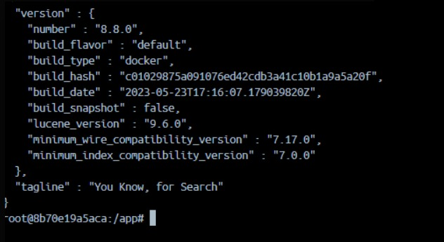

Para confirmar que ElasticSearch esté en pie y respondiendo correctamente desde el backend, se hizo una prueba interna en el contendedor:

```Javascript
(async () => {
  try {
    await client.ping({}, { requestTimeout: 3000 });
    console.log('🟢 Elasticsearch is up and running!');
  } catch (error) {
    console.error('🔴 Elasticsearch cluster is down!', error.message);
  }
})();
```

Dichaprueba devolvió el resultado esperado:


## ⚠️**Errores a partir de aquí**

1. **Creación del index de Products**

Se creó un archivo llamado createElasticIndex.js cuya función era al hacer node al app.js levantar el índice "products" para guardar los productos, sin embargo, al hacer el compose y revisar los logs del backend se mostraba el mensaje de error en la creación.

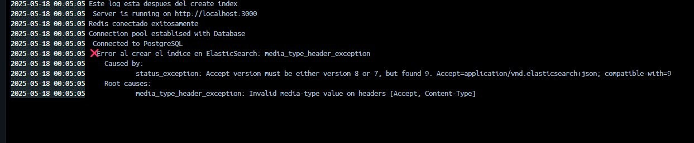

Lo que significa que el archivo `createElasticIndex.js` no estaba levantando el índice de productos.

Para solucionar esto, entramos al contenedor directamente para crear el índice desde ahí.

##### Creación manual del índice

Para la creación manual entramos al contenedor  con el comando docker exec -it proyecto-1-backend-1 /bin/bash `docker exec -it proyecto-1-backend-1 /bin/bash`

Y desde le contenedor se hizo la solicitud 

```bash
curl -X PUT "http://elasticsearch:9200/products" -H 'Content-Type: application/json' -d '{
  "mappings": {
    "properties": {
      "name": { "type": "text" },
      "description": { "type": "text" },
      "menu_id": { "type": "integer" },
      "price": { "type": "float" }
    }
  }
}'
```
Luego de crearlo se verifica la existencia del mismo con el comando:  `curl -X GET "http://elasticsearch:9200/_cat/indices?v"`

El resultado fue el siguiente:

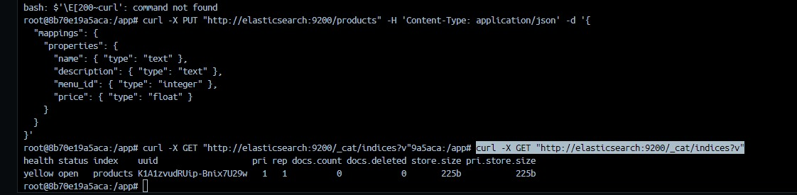

En donde se ve que el índice fue creado.

A partir de aquí se modificó el controller de productos para insertar una vez creado un producto en las bases de datos y en Elastic porque logrando insertar los productos, la búsqueda sería más rapida de implementar.

Pero los problemas a partir del intento de insertar productos no nos dejaron avanzar.

Cuando se intentó hacer un POST para crear un producto se obtuvo el siguiente error:

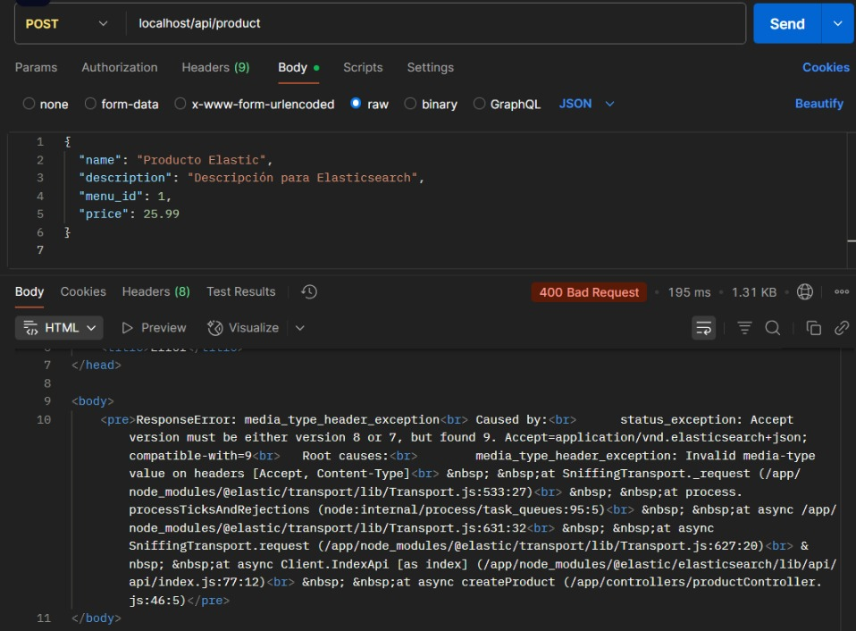

Ese error se debe a un problema de compatibilidad entre la versión de Elasticsearch (8.x) y la configuración de los headers en el cliente de Elasticsearch.

Para solucionarlo tratamos de cambiar la imagen del compose a latest, pero eso también nos dio un error:

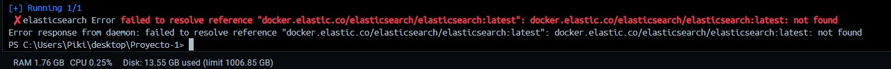

Ese error se corrigió arreglando el compose y la versión d ela imegn, sin embargo, apareció un nuevo error al tratar de hacer el POST:


ResponseError: media_type_header_exception<br>	Caused by:<br>		illegal_argument_exception: Incorrect header [Accept]. Only one value should be provided<br>	Root causes:<br>		media_type_header_exception: Invalid media-type value on headers [Accept]<br> &nbsp; &nbsp;at SniffingTransport._request (/app/node_modules/@elastic/transport/lib/Transport.js:533:27)<br> &nbsp; &nbsp;at process.processTicksAndRejections (node:internal/process/task_queues:95:5)<br> &nbsp; &nbsp;at async /app/node_modules/@elastic/transport/lib/Transport.js:631:32<br> &nbsp; &nbsp;at async SniffingTransport.request (/app/node_modules/@elastic/transport/lib/Transport.js:627:20)<br> &nbsp; &nbsp;at async Client.IndexApi [as index] (/app/node_modules/@elastic/elasticsearch/lib/api/api/index.js:77:12)<br> &nbsp; &nbsp;at async createProduct (/app/controllers/productController.js:28:5)</pre>


Este error está relacionado a la forma en que las versiones manejan los headers en los request. Después de aquí no pudimos solucionar y comenzamos a tener problemas con la conexion con Elastic y con el network del backend.


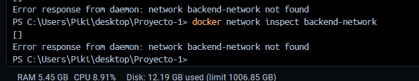

## Conclusiones

Se realizaron múltiples intentos de conexión y configuración para que ElasticSearch funcionara correctamente con Docker, Traefik y Node.js.

Los problemas de incompatibilidad de headers y errores de red fueron las causas principales de los fallos.

A pesar de los múltiples intentos, la integración no se completó exitosamente, pero queda demostrado en la documentación los errores y las soluciones probadas.


# **Implementación de Caché con Redis en API REST**

## **Descripción General**
La integración de Redis en nuestra API REST permite optimizar el rendimiento de las consultas a la base de datos PostgreSQL o Mongo. Mediante el uso de un middleware de caché, las respuestas frecuentes se almacenan temporalmente en Redis, reduciendo el tiempo de respuesta en futuras solicitudes.


## **Infraestructura en Docker Compose**
La configuración para Redis se define en el archivo `docker-compose.yml`, el cual especifica un contenedor dedicado para Redis:

```yaml
redis:
  container_name: redis
  image: redis:latest
  ports:
    - "6379:6379"
  networks:
    - backend-network
```


## **Conexión a Redis en el Proyecto**
La conexión a Redis se realiza mediante un cliente de Redis en un archivo especifico:

```javascript
// db/redisClient.js
const redis = require("redis");
const client = redis.createClient({
  url: process.env.REDIS_URL,
});
const DB_TYPE = process.env.DB_TYPE;

client.on("connect", () => {
  console.log("Redis conectado exitosamente");
});
client.on("error", (err) => {
  console.error("Error en Redis:", err);
});
(async () => {
  await client.connect();
})();
const getPrefixedKey = (key) => `${DB_TYPE}:${key}`;
module.exports = {
  client,
  getPrefixedKey,
};
```


## **Middleware de Caché**
Para evitar duplicación de código, se desarrolló un middleware reutilizable, esto para que en cada controlador del backend sea más unificado y evite duplicación de trabajo.

```javascript
// middlewares/cacheMiddleware.js
const { client: redisClient, getPrefixedKey } = require("../db/redisClient");

const cacheMiddleware = (keyGenerator) => async (req, res, next) => {
  const cacheKey = getPrefixedKey(keyGenerator(req));

  try {
    const cachedData = await redisClient.get(cacheKey);

    if (cachedData) {
      console.log("Cache hit");
      return res.status(200).json({
        status: 200,
        message: "Data fetched from cache",
        data: JSON.parse(cachedData),
      });
    }

    console.log("Cache miss");
    next();
  } catch (err) {
    console.error("Error al acceder al caché:", err);
    next();
  }
};

module.exports = cacheMiddleware;
```

##  **Integración en Controladores**
A modo de ejemplo, vamos a integrar el caché en el controlador de menus.
En el controlador de menús, el caché se implementa de la siguiente forma:
Es en el controlador donde se manjea la política de expiración que en nuestro caso es 1 hora.

```javascript
// controllers/menuController.js
const { getRepository } = require("../repositories/repositoryFactory");
const menuRepo = getRepository("menu");
const { client: redisClient, getPrefixedKey } = require("../db/redisClient");

const getAllMenus = async (req, res, next) => {
  try {
    const menus = await menuRepo.findAll();
    res.status(200).json({
      status: 200,
      message: "Menus fetched successfully",
      data: menus,
    });

    // Guardar en caché
    const cacheKey = getPrefixedKey("all_menus");
    await redisClient.set(cacheKey, JSON.stringify(menus), {
      EX: 60 * 60, // Expira en 1 hora
    });
  } catch (err) {
    console.error("Error en getAllMenus:", err.message);
    next(err);
  }
};

module.exports = {
  getAllMenus,
};
```


##  **Resultado Esperado**
- Primera consulta a `/api/menus` → **Cache Miss** y respuesta desde PostgreSQL/Mongo.
- Segunda consulta → **Cache Hit** y respuesta desde Redis.
- Clave almacenada en Redis: `postgres:all_menus`.

Para validar en Redis:
```bash
docker exec -it redis redis-cli
127.0.0.1:6379> KEYS *
```

Con eso se ven todas las keys que han sido guardadas hasta el momento.


# **Bases de Datos en el Sistema**

En esta seccion detallamos la arquitectura de bases de datos híbrida que utiliza nuestro sistema, integrando tanto una base relacional (PostgreSQL) como una base NoSQL distribuida (MongoDB con sharding y replicación).

### Configuracion
Los controladores y modelos en el código se diseñaron con el patrón Repositorio para permitir el intercambio entre __PostgreSQL__ y __MongoDB__ mediante la variable de configuración _DB_TYPE_.


## 🐘 PostgreSQL

Esta es la base de datos principal, generada previamente en el Trabajo Corto #1. 

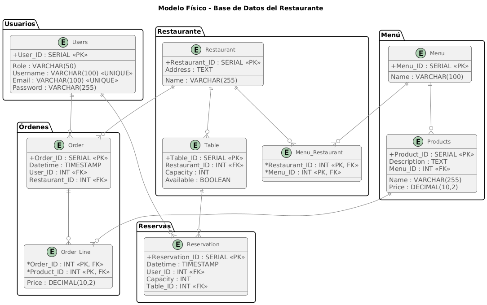

## 🍃 MongoDB con Replicación y Sharding

Esta base de datos se implemento como parte del Trabajo Corto #3, con la función de ser reutilizada en este proyecto. 
Se parte de código brindado por el docente, al cuál se le agrega un shard y réplica adicional para cumplir las especificaciones del proyecto. Además, se configuran los datos, particiones y otros. 

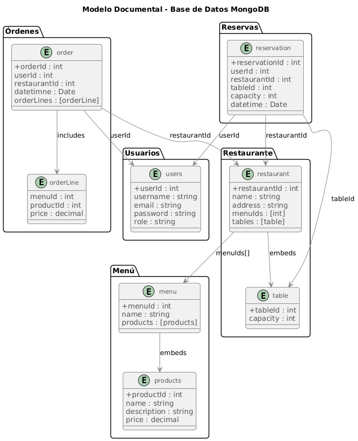

#### Arquitectura configurada

- __Conjunto de réplicas:__ cada shard contiene 3 réplicas (1 primario y 2 secundarios) para alta disponibilidad.
-  __Sharding:__ los datos de productos y reservas se distribuyen en múltiples shards para soportar grandes volúmenes y paralelismo. 
   - La coleccion _Usuarios_ se configura con _Hashed Sharding_ con la llave _UserId_.
   - Las colecciones _Publicaciones_ y _Comentarios_ se configuran con _Ranged Sharding_, utilizando las llaves _UserId_ y _PostId_ consecutivamente. 
- __Persistencia:__ Todos los contenedores Mongo usan volúmenes Docker dedicados para almacenar los datos y garantizar la persistencia en reinicios o actualizaciones. Si se iniciar desde 0, es importante eliminar los volumenes.

#### Componentes del clúster MongoDB

- `mongors1n1`, `mongors1n2`, `mongors1n3` → Réplicas del shard 1
- `mongors2n1`, `mongors2n2`, `mongors2n3` → Réplicas del shard 2
- `mongors3n1`, `mongors3n2`, `mongors3n3` → Réplicas del shard 3
- `mongocfg1`, `mongocfg2`, `mongocfg3` → Config servers
- `mongos1` → Enrutador del clúster


# **Uso del Balanceador de Carga**

### Función

En nuestra arquitectura, generamos un contenedor con el servicio Traefik para implementar un balanceador de carga y proxy inverso que redirige el tráfico a los servicios correctos según la ruta utilizada en una consulta específica.  

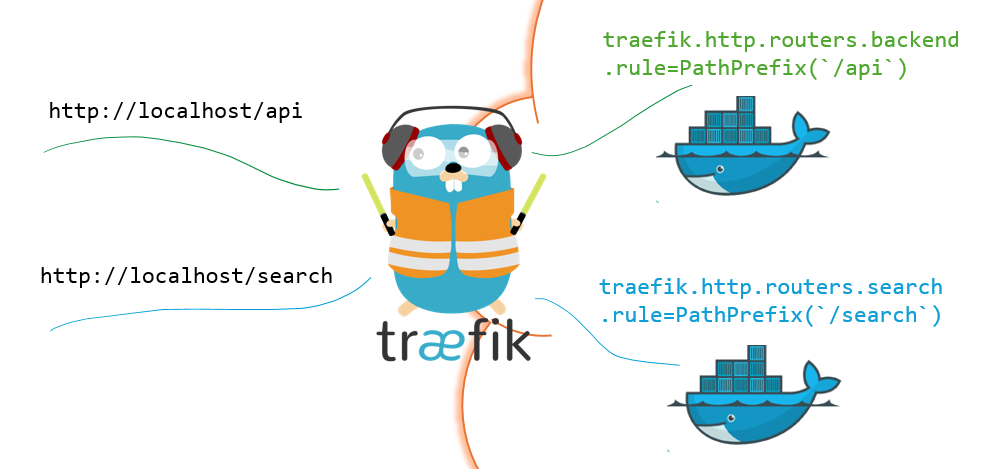


### Configuración

Decidimos utilizar __Traefik__ sobre otros servicios de balanceo de carga como Nginx o Kubernetes debido a su facilidad de configuración mediante _labels_ en el _docker_compose_ y el balanceo de carga automático.

#### Rutas configuradas

- `/api/**` → servicio __Backend__.
- `/search/**` → servicio __Elastic__.

#### Configuración
- __Red:__ para la comunicación de __Traefik__ con los servicios __Backend__ y __Elastic__ se necesitan agregar a una red común, para lo cual se eligió __backend-network__.
- __Puertos:__ el servicio __Traefik__ está escuchando en el puerto _8080_, el cual es el default de _localhost_. Además, los servicios __Backend__ y __Elastic__ se configuraron para escuchar a __Traefik__ en los puertos _3000_ y _4000_ consecutivamente. 
- __Verificacion:__ gracias al argumento `--api.insecure=true` se logra tener acceso al Dashboard propio del servicio en la dirección http://localhost:8080/dashboard/.
- __Balanceo:__ el servicio de balanceo de cargas de __Traefik__ balancea entre consultas en multiples instancias de un servicio, por lo cual si no se escala un microservicio no se activa ni es necesario el balanceo. La estrategia de balanceo utilizada es la predeterminada: RoundRobin que toma en cuenta la carga actual en cada instancia de un servicio. 


### Referencias utilizadas
Para esto, nos basamos de tutoriales en YouTube y la documentación de la página [Traefik & Docker](https://doc.traefik.io/traefik/routing/providers/docker/).


# **Pipeline CI/CD**

Debido a que de previo estabamos utilizando _GitHub_ como servicio de control de versiones Git, fue instintivo utilizar __Github Actions__ como herramienta de integracion despliegue continuo. 

### Configuracion 

La configuracion del pipeline CI/CD se realizo por medio del archivo __.github\workflows\docker-image.yml__, el cual se ejecuta automaticamente en GitHub tras una actualizacion del repositorio en la rama principal (lo que se realiza con el comando `git push origin main`).

### Etapas del pipeline

1. **Instalación de dependencias:** debido a que las pruebas unitarias y de integracion se realizaron con la libreria _Jest_ para _Node.js_, se deben instalar las dependencias necesarias para su correcta ejecucion. Las dependencias que se instalan son las mismas del microservicio __API__.
2. **Ejecución de pruebas (unitarias/integración):** las pruebas se ejecutan por medio del comando `npm test`. Con solo una prueba que esté incorrecta, se interrupte el flujo del pipeline y da un símbolo de error en GitHub.
3. **Construir y subir las imágenes Docker:** se inicia sesion en la cuenta _josianamj_ de Docker para subir las imagenes creadas para este proyecto, con la funcion de que estas puedan ser accedidas desde multiples maquinas sin necesidad de construccion. 

Si el pipeline completo se ejecuta de manera correcta, en el repositorio aparece un ✅, al hacerle click podemos ver un mensaje de éxito.

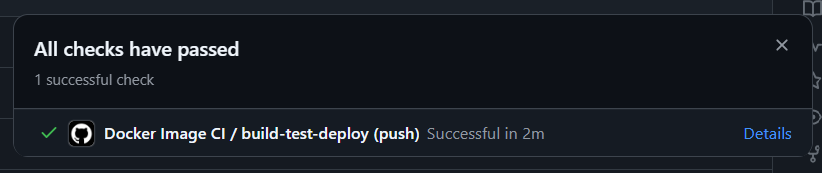

### Posterior al pipeline
Como indicado en el enunciado, el despliegue del sistema se realiza de forma local. Para esto, es necesario seguir los siguientes pasos:

1. __Descargar imagenes de Docker__
Con los siguientes comandos se descargarán las versiones más recientes de las imagenes creadas para este proyecto. 

```powershell
docker pull josianamj/postgres_db:latest 
docker pull josianamj/backend_image:latest
docker pull josianamj/redis_image:latest
docker pull josianamj/setup_mongo:latest
docker pull josianamj/charge-data:latest
```

2. __Levantar los contenedores__
Por medio del siguiente comando, se realizará el levantamiento de los contenedores que componen el sistema del proyecto.

```powershell
docker-compose up -d
```
O alternativamente para levantar un sistema con escalado horizontal en los microservicios:
```powershell
docker compose up -d --scale backend=3 --scale elastic=2
```

3. __Bajar los contenedores:__ Al finalizar las pruebas, puede "bajar" (detener la ejecucion y eliminar) los contenedores por medio del siguiente comando:

```powershell
docker compose down -v
```
